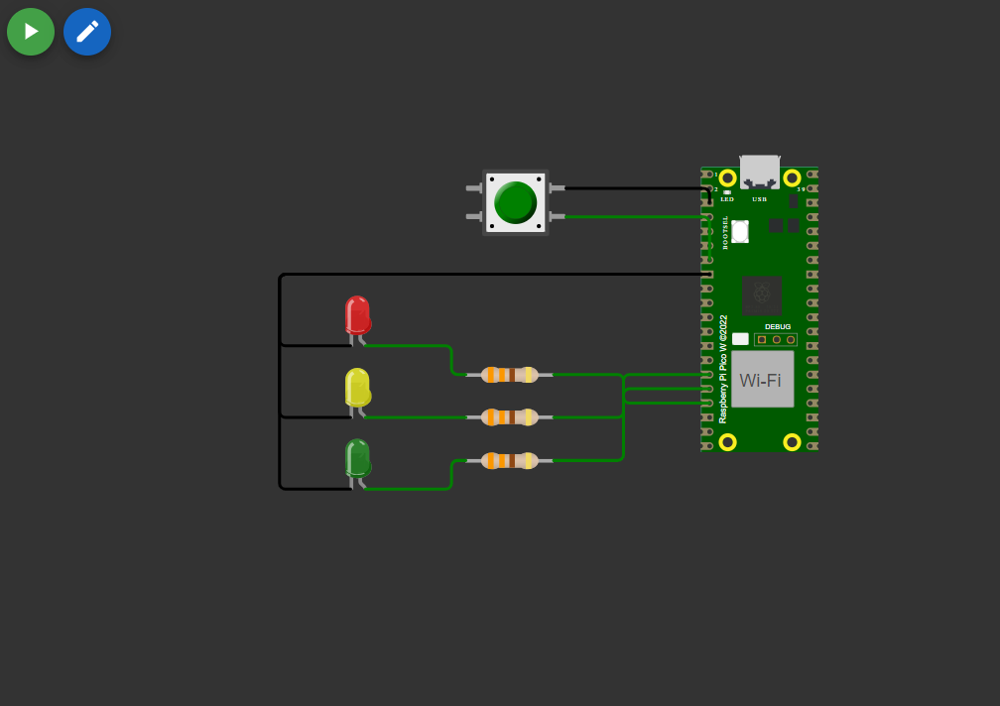

# Controle de LEDs com temporização periódica

## Descrição
Com o auxílio do simulador de eletrônica Wokwi, foram utilizados 3 leds (vermelho, amarelo e verde), parea simular um semáforo com temporização de 3 segundos para cada alteração de sinal.

1) 03 LEDs (vermelho, amarelo e verde).
2) Microcontrolador Raspberry Pi Pico W

## Observações
- Caso queira rodar o codigo na placa BitDogLab, interprete o led azul como amarelo.
- Essa branch é da atividade 1, caso queira compilar a aatividade 2 alterne para a outra branch disponível.

## Como compilar
Para compilar o programa, utilize um compilador C, e rode o código para geração do arquivo `.uf2` e `.elf`. Segue um exemplo:

## Como executar
Após a compilação, execute o simulador Wokwi clicando no arquivo `diagram.json`:

Para testar, só clicar no play e observar o funcionamento do semáforo.

## Requisitos
- Compilador C (gcc ou equivalente).
- Sistema operacional compatível com programas C.
- Extensão Raspberry Pi Pico 
- Wokwi conectado no VS Code
